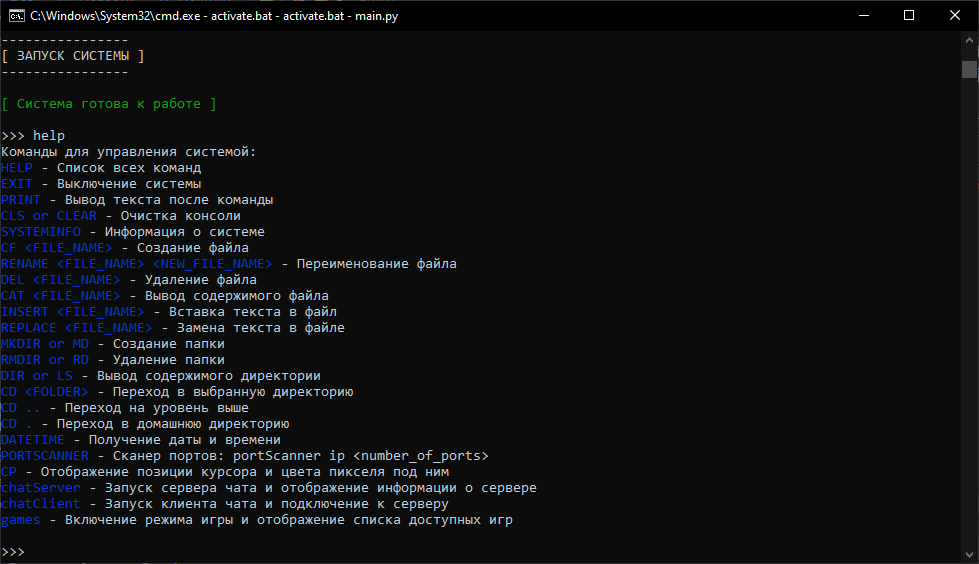

# Amina

Amina — виртуальная операционная система (ОС), написанная на Python.



---

Чтобы установить эту программу, вам необходимо скопировать этот репозиторий в выбранную вами директорию с помощью команды:

```git
git clone https://github.com/Fadis-Fairushin/Amina.git
```

---

После этого создайте venv внутри установленного каталога и активируйте ее соответствующими командами:

```python
python -m venv venv
```

Для Windows:

```python
venv\Scripts\activate.bat
```

Для Linux и MacOS:

```python
source venv/bin/activate
```

---

Откройте консоль, перейдите в каталог программы и введите следующую команду для установки всех модулей:

```python
pip install -r requirements.txt
```

---

Теперь вы можете запустить программу командой:

```python
python main.py
```

Или, если вы используете Windows, дважды щелкните файл active.bat.
